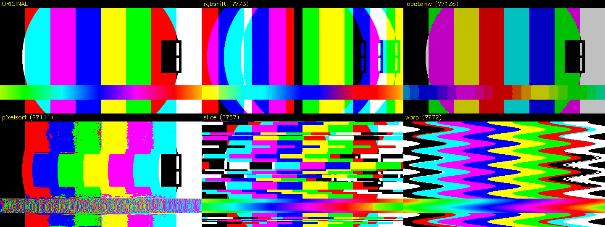

# CRAZY VIDEO GLITCH EDITOR

Post-production chaos machine — channel lobotomy, datamosh, freezes, frame
shuffling, zoom-punches, pixel melt and strobe, all **beat-synced** to the
audio. With **multi-layer compositing** (weird blend modes), **frame granular
synthesis** (a video grain-cloud + matching granular *audio*), **audio-reactive
modulation**, a one-button **Auto-Lobotomizer** (beat-driven time-remap +
glitch chain), **live performance control** (gamepad / MIDI / webcam / screen),
a real **databend** effect, **live preview sound**, and **mp4 / webm / gif
export**. Desktop GUI with live preview + a real ffmpeg/opencv render backend.



## Run

```bash
./run.sh                 # launch the GUI
# or
python3 main.py
```

Batch render from the command line (no GUI):

```bash
python3 main.py input.mp4 out.mp4 --preset brainfuck --datamosh --speed 1.5
```

Requires `ffmpeg` + `ffprobe` on PATH and the packages in `requirements.txt`
(PySide6, opencv, numpy, librosa, soundfile). On this machine they're already
installed; encode uses `h264_nvenc` (GPU) when available.

## How to use the GUI

1. **➕ Video Layer** — add a clip. Beats/onsets are detected automatically from
   the first video layer (cyan = beats, dim = onsets). Silent clips fall back to
   a 120 BPM grid.
2. **➕ Granular Layer** — pick a clip to shatter into a frame **grain cloud**
   (see below). It also produces matching granular *audio*.
3. **Layers** panel (bottom→top compositing): select a layer to edit it; set its
   **blend mode**, **opacity**, timeline **start** and **trim**; reorder ▲▼.
4. With a layer selected, the **Effects** tab is its effect stack; the
   **Granular** tab is its grain controls (granular layers only).
   Each effect card has: enable, **Amount**, **Beat** mode (`always` / `pulse` /
   `gate`) + division (`÷N` = every Nth beat) + **Hold**, then its own params.
5. **Load a preset** to drop a chain onto the selected layer, **Add fx**, or
   **🧠 Lobotomize** a video layer to auto-generate the whole edit. **Save FX**
   stores a chain as a reusable preset. Each effect can be **audio-reactive**
   (Audio source + Mod depth) and the **Live** tab maps a gamepad/MIDI to it.
6. Scrub / **Play** to preview live (🔊 toggles sound).
7. Pick **Format** (mp4/webm/gif) + **Res**, set **Speed**, toggle **Datamosh**,
   hit **⚡ RENDER**.

## Layers, blend modes & timeline

Stack any number of video/granular layers; each is composited bottom→top with a
blend mode and opacity, and runs through its own effect chain. Blend modes:
`normal, add, screen, multiply, difference, exclusion, lighten, darken, overlay,
hardlight, subtract, divide, xor, and, or, average`. Per-layer **start** and
**trim** place clips on the timeline so they hit at different times — the
"chopped, reordered clips" of a lobotomy edit.

## Frame granular synthesis

A *grain* is a short slice of a clip — a patch of a frame, played from some
position at some rate for some duration, windowed and scattered in space and
time. Many overlapping grains resynthesize a new "cloud" clip. Controls mirror
audio granular synthesis: **density** (grains/sec), **grain size**, **position**
+ **scan** + **spray** (where in the source), **rate** + jitter + **reverse**
(playback speed/direction), **grain area** + **scatter** + **zoom** + **angle**
(spatial), and grain **blend**/**gain**. The *same grain schedule* drives the
audio granulator, so picture and sound granulate in lockstep — the JUCE/Faust
granular idea, done in numpy (no C++).

## Sound

The original audio is muxed into every render (with `atempo` for speed). Granular
layers synthesize their own glitch audio from the shared grain schedule. **Live
preview audio** plays via `sounddevice` while you scrub/play (🔊 toggle).

## Audio-reactive modulation

Every effect card has an **Audio** source (`rms` / `bass` / `mid` / `high`) and a
**Mod depth**. The effect's strength then tracks that audio band — bass → zoom
punch, highs → RGB tear, loudness → grain density — composed with the beat gate.
Envelopes are analysed from the music with librosa (STFT bands + RMS).

## Auto-Lobotomizer & time-warp

**🧠 Lobotomize** (on a selected video layer) generates the whole lobotomy edit:
a **beat-driven time-warp** (freeze / speed-ramp / reverse / jump per beat that
remaps the *video* sampling against a steady music bed — audio stays in sync) plus
an audio-reactive, beat-synced glitch chain, and turns on Datamosh. The time-warp
is its own engine piece (`warp.py`) usable on any layer.

## Live performance control

The **Live** tab maps an Xbox-style **gamepad** (pygame) and **MIDI** (rtmidi) to
params of the selected layer — stick/triggers/buttons or CCs → effect amounts and
granular controls, live. Add a **➕ Webcam** or **➕ Screen** layer as a live
source (they record whatever's happening when you render). Gamepad needs a
controller connected and the user in the `input` group
(`sudo usermod -aG input $USER`, then re-login).

## Export & presets

Render to **mp4 / webm / gif** at **Source / 1080p / 720p / 480p**. **Save FX**
stores the selected layer's effect chain as a named user preset (in `fx_presets/`)
that shows up in the preset dropdown alongside the built-ins.

## Beat sync — the secret sauce

Every effect can fire on the music:

- **always** — runs on every frame.
- **pulse** — strength decays after each beat (zoom-punches, shake bursts).
- **gate** — hard on for `Hold` seconds after each beat (strobe, slice).
- **÷N** — only act on every Nth beat (`÷4` = once a bar).

## Effects

| Effect | What it does |
|---|---|
| RGB Shift | Chromatic channel tear, optional wobble |
| Channel Lobotomy | Bit-crush + channel swap + channel kill |
| Camera Shake | Per-frame jitter |
| Zoom Punch | Scale-in hit (defaults to beat pulse) |
| Stutter / Freeze | Latch a frame on the beat and repeat it |
| Frame Shuffle | Jump to a random recent frame on the beat |
| Echo / Trails | Feedback smear (datamosh-ish) |
| Pixel Sort | Brightness-sorted pixel melt (H/V) |
| Slice Displace | Random horizontal tear bands |
| Wave Warp | Sinusoidal row displacement |
| Strobe / Invert | Beat-flash invert / white / black |
| Databend (JPEG) | Real JPEG byte-corruption — compression-artifact glitch |
| VHS / Decay | Scanlines + chroma bleed + noise |

**Presets:** `brainfuck`, `seizure`, `datamoshhell`, `vapordecay`, `pixelmelt`.

## Datamosh (the real thing)

When enabled, the frame chain is encoded to an mpeg4 AVI with recurring
I-frames, then I-frames are stripped at the byte level (`glitchcore/datamosh.py`)
so P-frame motion vectors bloom over the wrong content — true codec corruption,
not a shader fake. Best-effort: if the parse looks wrong it falls back to the
clean render.

## Architecture

```
glitchcore/        headless engine (no Qt) — importable / scriptable
  effects.py       all effects + registry (subclass Effect, auto-registers)
  chain.py         ordered effect stack applied per frame
  context.py       FrameContext + BeatClock (musical timing)
  beat.py          librosa beat/onset detection
  blend.py         layer blend modes (normal … xor/average)
  sources.py       VideoSource — random-access frame cache + preloader
  live.py          Webcam + Screen live sources
  granular.py      frame granular synthesis (Grain + Granulator)
  audio.py         audio load, granular audio, AudioEnv (reactive), live player
  warp.py          beat-driven variable time-remap (TimeWarp)
  auto.py          Auto-Lobotomizer (warp + glitch chain generator)
  comp.py          Layer (+warp) + Timeline compositor
  media.py         ffprobe + ffmpeg frame-pipe encode/mux (+ atempo for speed)
  datamosh.py      raw AVI I-frame stripper
  renderer.py      render() single-input + render_timeline() multi-layer
  presets.py       preset chains
gui/               PySide6 UI on top of the engine
  main_window.py   layers, preview, effect/granular/live tabs, audio, render
  widgets.py       param controls + effect card + granular panel + live panel
  timeline.py      beat-marked timeline / playhead
  live_input.py    gamepad (pygame) + MIDI (rtmidi) input hub
  render_worker.py beat + single + timeline render QThreads
main.py            GUI launcher / CLI batch render
```

The engine is fully decoupled from the GUI — add an effect by subclassing
`Effect` and declaring `PARAMS`; the GUI builds its controls automatically.

## Inspiration / research

- **Lobotomy-core / free-lobotomy** edits — chopped clips, playback glitches,
  freeze-before-the-sting, hard cut after, over breakcore. The "chop + reorder +
  beat-sync" blueprint behind layers + granular.
- **Video Granular Synthesis** — Forbes, *Computational Aesthetics* 2015
  ([pdf](https://angusforbes.com/pdfs/Forbes_VideoGranularSynthesis_CAe2015.pdf)):
  grains = frames/time-slices, cloned/rotated/resized/repositioned in space &
  time, scattered asynchronously into clouds. The model behind `granular.py`.
- **Glitch art / digital anti-art** — Rosa Menkman (error as expression,
  anti-resolution), JODI, databending & datamoshing
  ([overview](https://en.wikipedia.org/wiki/Glitch_art)). The why behind
  Databend + Datamosh.

## Notes / roadmap

- Preview runs at 1× speed (downscaled); the **Speed** control affects the
  final render only. Granular audio ignores global Speed (it has its own timing).
- `px`-based effects are previewed on a downscaled frame, so magnitudes look a
  touch larger than the full-res render.
- Live preview audio is the source/granular buffer played free-running; it can
  drift slightly from the QTimer-driven video over long clips.
- Next: variable (beat-driven) time-remap, audio-reactive amount envelopes,
  optical-flow datamosh, per-effect timeline ranges, drag-on-timeline clip UI,
  real-time granular audio streaming.
