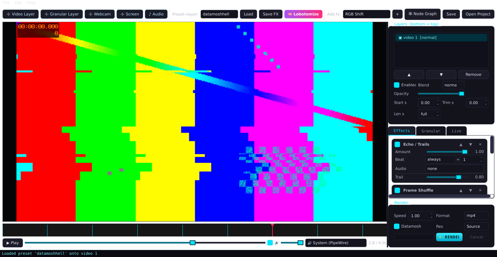
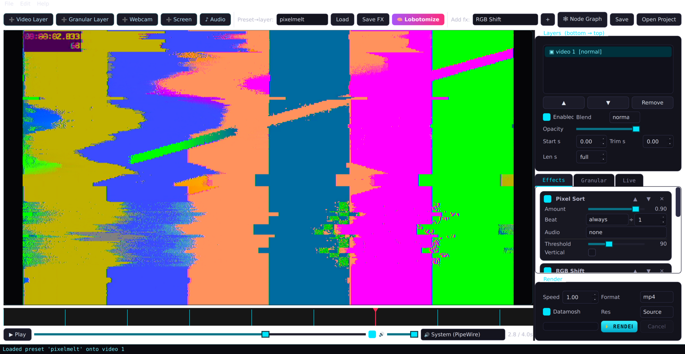
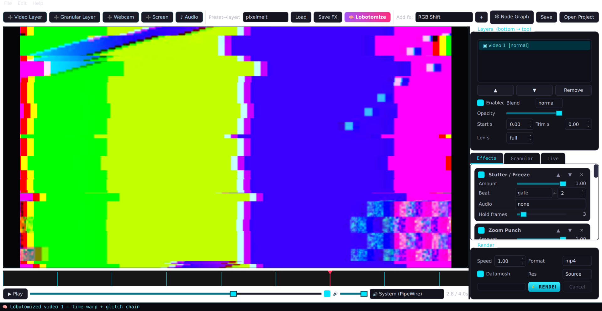
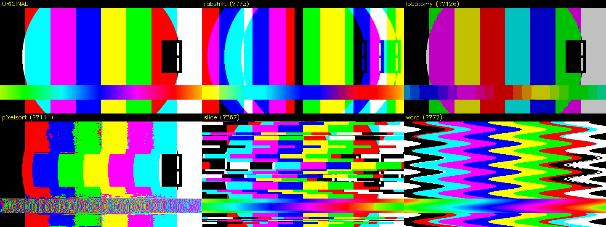

# Crazy Video Glitch Editor

Take a clip, destroy it on the beat. A desktop video glitch editor for
datamosh, channel lobotomy, pixel-sort melt, frame-granular synthesis and
audio-reactive chaos — with a live preview and a real ffmpeg/opencv render
backend.



## What it is

A headless glitch engine (`glitchcore/`, no Qt) plus a PySide6 desktop GUI.
Every effect can fire on detected beats and react to the audio, so a render is
chopped, reordered and corrupted in time with the music instead of by hand. It
ships with multi-layer compositing, frame-granular synthesis (a video grain
cloud *and* matching granular audio from the same schedule), a one-button
Auto-Lobotomizer, optical-flow datamosh, GPU shaders, a node-graph mode, and
live performance control (gamepad / MIDI / webcam / screen → a virtual cam).

The engine is fully scriptable on its own — the command-line renderer uses it
directly, with no GUI in the loop.

| Pixel-sort melt | Auto-Lobotomizer (time-warp + glitch chain) |
|---|---|
|  |  |



## Run

```bash
pip install -r requirements.txt
./run.sh                      # or: python3 main.py
```

Batch render from the command line (no GUI — two positional args switch to CLI):

```bash
python3 main.py in.mp4 out.mp4 --preset brainfuck --datamosh --speed 1.5 --seed 42
```

Requires `ffmpeg` + `ffprobe` on `PATH`. Encoding uses `h264_nvenc` (NVIDIA) when
available and falls back to `libx264`. Optional extras: `torch` enables real
MiDaS depth in Depth Displace; live features need system **portaudio** (audio)
and **v4l2loopback** (virtual cam); GPU shaders need a working GL context.

`./install.sh` adds a desktop launcher (app menu + Desktop) for double-click
launch.

## How it works

- **Effects** (`glitchcore/effects.py`) — every effect subclasses `Effect` and
  declares its parameters; the GUI builds the controls for it automatically. The
  base class handles beat-sync and audio modulation for free, so an effect's
  strength is `beat_gate × amount × audio` every frame.
- **Beat sync** — beats and onsets are detected with librosa from the first
  video layer (or an imported soundtrack). Each effect runs `always`, as a
  decaying `pulse` after each beat, or hard-`gate`d for a hold time, optionally
  only every Nth beat.
- **Audio-reactive** — each effect can track an audio band (`rms`/`bass`/`mid`/
  `high`) so loudness drives grain density, bass drives zoom punches, highs drive
  RGB tear, and so on.
- **Compositing** — `Chain` (ordered effects) → `Layer` (a source + placement +
  blend + its own chain) → `Timeline` (layers composited bottom-to-top with
  blend modes). A layer's source is a video, a granulator, or a live webcam/
  screen, and a beat-driven time-warp can remap a layer's content time against a
  steady music bed (freeze / ramp / reverse / jump).
- **Frame granular synthesis** (`granular.py`) — a clip is shattered into a cloud
  of windowed frame grains scattered in space and time. The *same* grain
  schedule drives the audio granulator, so picture and sound granulate in
  lockstep.
- **Datamosh** (`datamosh.py`) — the real thing: frames are encoded to an mpeg4
  AVI with recurring I-frames, then I-frames are stripped at the byte level so
  P-frame motion vectors bloom over the wrong content. Not a shader fake.

For the full architecture, see [`CLAUDE.md`](CLAUDE.md).

## Effects

| Effect | What it does |
|---|---|
| RGB Shift | Chromatic channel tear, optional wobble |
| Channel Lobotomy | Bit-crush + channel swap + channel kill |
| Camera Shake | Per-frame jitter |
| Zoom Punch | Scale-in hit (defaults to beat pulse) |
| Stutter / Freeze | Latch a frame on the beat and repeat it |
| Frame Shuffle | Jump to a random recent frame on the beat |
| Echo / Trails | Feedback smear (datamosh-ish) |
| Pixel Sort | Brightness-sorted pixel melt (H/V) |
| Slice Displace | Random horizontal tear bands |
| Wave Warp | Sinusoidal row displacement |
| Strobe / Invert | Beat-flash invert / white / black |
| Databend (JPEG) | Real JPEG byte-corruption glitch |
| VHS / Decay | Scanlines + chroma bleed + noise |
| Optical Datamosh | Motion-vector melt (DIS optical flow) |
| Flow Smear | Push the frame along its own motion |
| Depth Displace | Parallax keyed by depth (MiDaS or luminance) |

Presets: `brainfuck`, `seizure`, `datamoshhell`, `vapordecay`, `pixelmelt`,
`motionmelt`. Export to mp4 / webm / gif at source / 1080p / 720p / 480p.

## Inspiration

- **Lobotomy-core edits** — chopped clips, playback glitches, freeze-before-the-
  sting, hard cut after, over breakcore. The chop-reorder-beat-sync blueprint
  behind layers and granular.
- **Video Granular Synthesis** — Forbes, *Computational Aesthetics* 2015
  ([pdf](https://angusforbes.com/pdfs/Forbes_VideoGranularSynthesis_CAe2015.pdf)):
  grains as frame/time-slices cloned and scattered into clouds. The model behind
  `granular.py`.
- **Glitch art / digital anti-art** — Rosa Menkman, JODI, databending and
  datamoshing ([overview](https://en.wikipedia.org/wiki/Glitch_art)). The why
  behind Databend and Datamosh.

## License

MIT — see [`LICENSE`](LICENSE). Copyright (c) 2026 willbearfruits.
